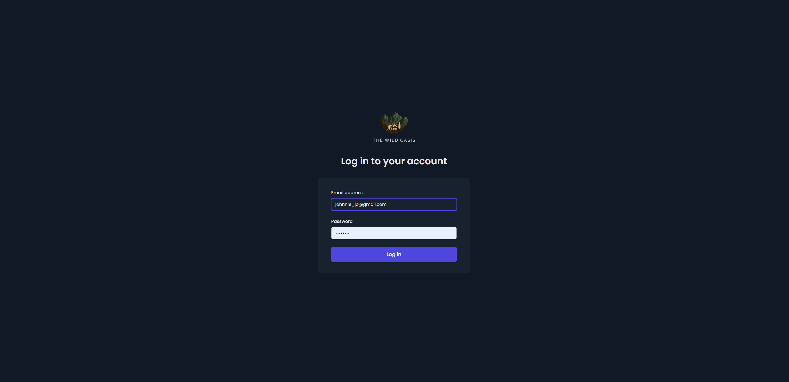
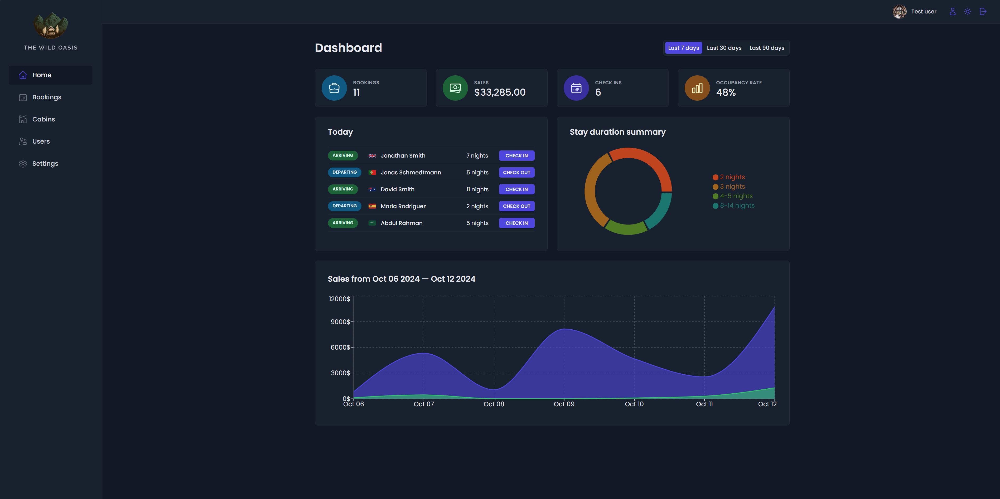
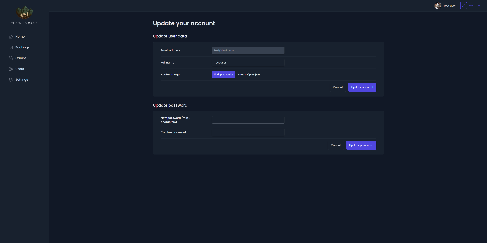
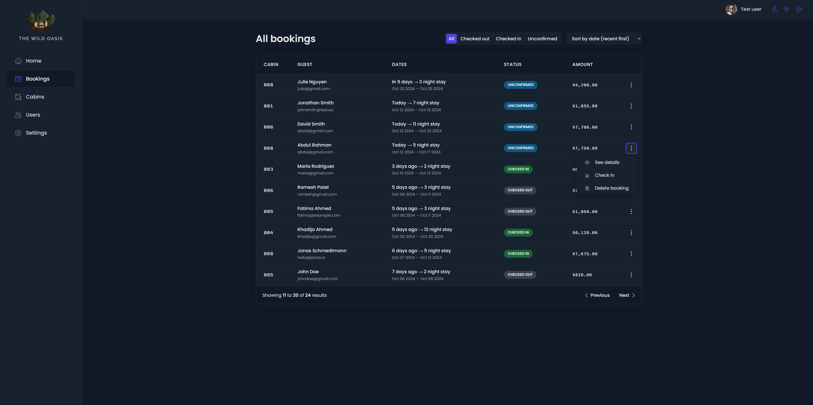
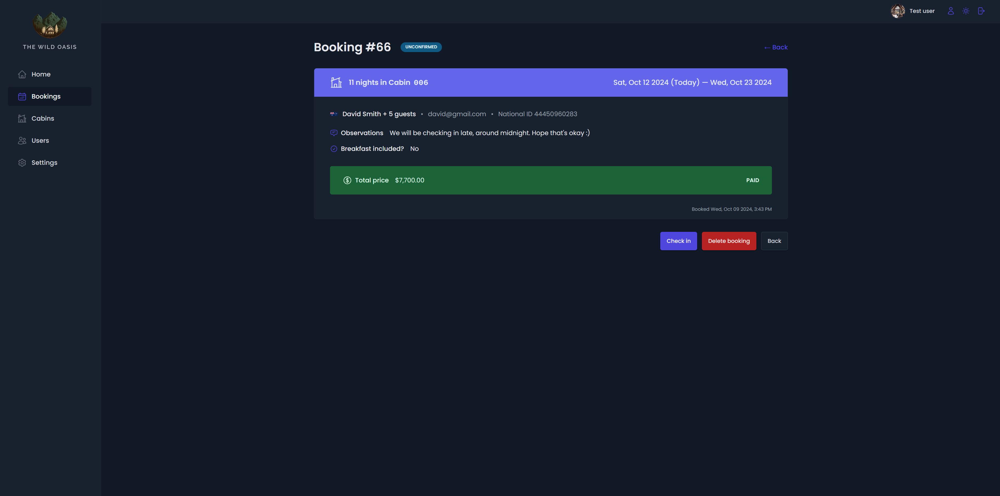
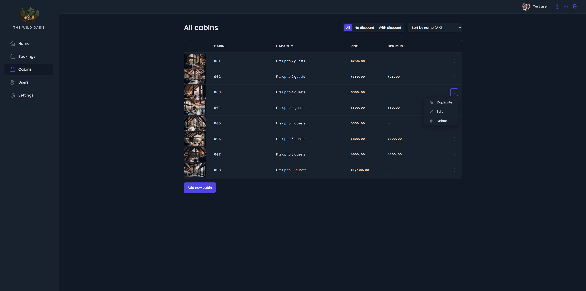
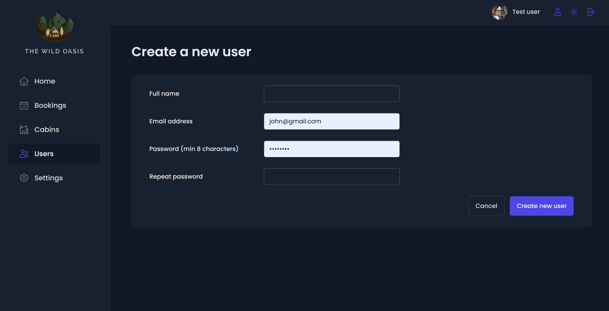
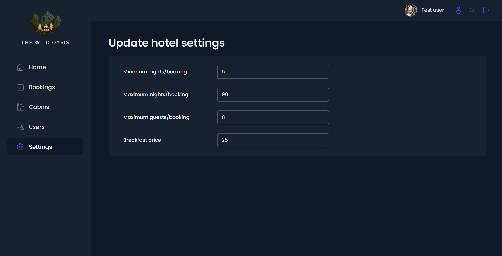

# Azure Oasis

**Disclaimer**: This project is based on the [The Ultimate React Course 2024: React, Next.js, Redux & More](https://www.udemy.com/course/the-ultimate-react-course/) Jonas Schmedtmann's course (project 2 from Part 4: Professional React Development). The primary purpose of this repository is for personal learning and practice. All credit for the original design and concepts goes to Jonas Schmedtmann. This repository serves as my implementation of the project following the course.

## Overview
Welcome to the Boutique Hotel Check-In App!
This internal app is designed for small boutique hotels with luxurious cabins. It streamlines the guest check-in process for hotel employees, allowing them to manage arrivals efficiently. With easy access to guest details, this app helps staff provide a smooth and personalized experience for every guest.

## Technologies Used
- React
- React Query
- Styled Components
- Supabase

## How to Run the Project
1. Install the packages
```
npm install
```
2. Run the application
```
npm run dev
```

### Usage

- **Welcome Page**
<br />The visually engaging welcome page allows users to log in quickly by entering their email and password. It provides a smooth, user-friendly start to the application.


- **Home Page**
<br />The home page showcases dynamic charts and statistics with options to filter data by 7, 30, or 90 days. It (just like all other pages) features theme switching (light/dark) and allows easy access to account settings and logout.


- **Account Page**
<br />On the account page, users can update their personal details, change their avatar, or reset their password, enhancing their overall experience and personalization options.


- **Bookings**
<br />The bookings page lists all reservations, displaying cabin details, guest information, stay dates, and booking status. Users can sort bookings, modify statuses, delete entries, and access more details. The page includes pagination for smoother navigation.


- **Individual Booking**
<br />This page shows additional details for a selected booking, including important comments and key information. Users can update the booking status, delete the entry, or return to the main bookings list via a back button.


- **Cabins**
<br />The cabins page lists all 8 available cabins, with sorting options by discount, name, price, and capacity. Users can easily add, duplicate, edit, or delete cabins, with information displayed clearly for quick reference.


- **Users Page**
<br />The users page allows employees to easily create new user accounts by entering the full name, email, and password. This ensures better control and prevents unauthorized registrations, maintaining security and oversight.


- **Settings**
<br />The settings page enables users to update key hotel settings, such as minimum and maximum nights, guest capacity, and breakfast price. Editing these parameters is quick and straightforward.
